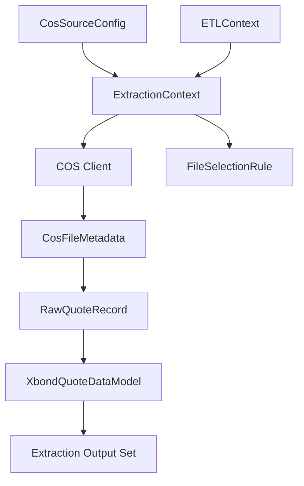

# Data Model: COS Xbond Quote Extraction

**Date**: 2026-01-09  
**Feature**: 001-cos-xbond-quote-extract

## Overview

This document defines the data structures for extracting Xbond Quote data from Tencent COS. The model includes source data structures, configuration entities, and the output data model that extends the existing `SourceDataModel` abstract class.

## Core Entities

### 1. CosSourceConfig
Extends `SourceConfig` with COS-specific connection settings.

| Field | Type | Required | Description | Default/Example |
|-------|------|----------|-------------|-----------------|
| endpoint | String | Yes | COS endpoint URL | `cos.ap-shanghai.myqcloud.com` |
| bucket | String | Yes | COS bucket name | `xbond-quote-data` |
| secretId | String | Yes | API key ID | (from INI config) |
| secretKey | String | Yes | API secret key | (from INI config) |
| region | String | No | COS region | `ap-shanghai` |
| prefix | String | No | Path prefix for filtering | `AllPriceDepth/` |

**Validation Rules**:
- All required fields must be non-empty strings
- Endpoint must be a valid URL format
- Bucket name must follow COS naming conventions

**INI Configuration Example**:
```ini
[source1]
name=xbond_quote_cos
type=cos
connectionString=cos://xbond-quote-data/AllPriceDepth/
cos.endpoint=cos.ap-shanghai.myqcloud.com
cos.bucket=xbond-quote-data
cos.secretId=${COS_SECRET_ID}
cos.secretKey=${COS_SECRET_KEY}
cos.region=ap-shanghai
dateField=transact_time
```

### 2. CosFileMetadata
Metadata about a COS file to be processed.

| Field | Type | Required | Description |
|-------|------|----------|-------------|
| key | String | Yes | Full object key/path in COS |
| size | Long | Yes | File size in bytes |
| lastModified | Date | Yes | Last modification timestamp |
| etag | String | No | Object ETag for integrity |
| storageClass | String | No | COS storage class |

### 3. RawQuoteRecord
Parsed representation of a single CSV row from source files.

| Field | Type | Source Column | Description | Transformation Rules |
|-------|------|---------------|-------------|---------------------|
| id | Long | `id` | Unique record identifier | None |
| underlyingSecurityId | String | `underlying_security_id` | Security identifier | Add ".IB" suffix if missing |
| underlyingSettlementType | Integer | `underlying_settlement_type` | Settlement type: 1=T+0, 2=T+1 | Map to settle_speed: 1→0, 2→1 |
| underlyingMdEntryType | Integer | `underlying_md_entry_type` | Side: 0=bid, 1=offer | Used for field mapping |
| underlyingMdEntryPx | Double | `underlying_md_entry_px` | Clean price | Used for bid/offer price fields |
| underlyingMdPriceLevel | Integer | `underlying_md_price_level` | Quote level (1-6) | Used for field mapping |
| underlyingMdEntrySize | Long | `underlying_md_entry_size` | Volume | Used for volume fields |
| underlyingYieldType | String | `underlying_yield_type` | Yield type: "MATURITY" or "EXERCISE" | Used for yield_type fields |
| underlyingYield | Double | `underlying_yield` | Yield value | Used for yield fields |
| transactTime | LocalDateTime | `transact_time` | Quote generation time | Parse format: "YYYYMMDD-HH:MM:SS.SSS" |
| mqOffset | Long | `mq_offset` | Message queue offset | Primary grouping key |
| recvTime | LocalDateTime | `recv_time` | System receive time | Parse format: "YYYYMMDD-HH:MM:SS.SSS" |

**Ignored Fields**:
- `underlying_symbol`: Always "-"
- `underlying_trade_volume`: Always empty
- `underlying_un_match_qty`: Always empty
- `mq_partition`: Always 0

### 4. XbondQuoteDataModel
Concrete implementation of `SourceDataModel` for Xbond Quote data.

**Inherits from `SourceDataModel`**:
- `metadata`: Map<String, Object> (inherited)
- `records`: List<Map<String, Object>> (inherited)

**Extended Fields** (each becomes a field in the record maps):

| Field Group | Field | Type | Required | Source Mapping | Description |
|-------------|-------|------|----------|----------------|-------------|
| **Identifier Fields** | `business_date` | String | Yes | Context `BUSINESS_DATE` | Trading date (YYYY.MM.DD) |
| | `exch_product_id` | String | Yes | `underlyingSecurityId` with ".IB" | Exchange product ID |
| | `product_type` | String | Yes | Constant "BOND" | Product type |
| | `exchange` | String | Yes | Constant "CFETS" | Exchange identifier |
| | `source` | String | Yes | Constant "XBOND" | Data source |
| | `settle_speed` | Integer | Yes | `underlyingSettlementType` mapping | Settlement speed: 0=T+0, 1=T+1 |
| | `level` | String | Yes | Constant "L2" | Quote level |
| | `status` | String | Yes | Constant "Normal" | Quote status |
| **Timestamps** | `event_time` | LocalDateTime | Yes | `transactTime` | Quote generation time |
| | `receive_time` | LocalDateTime | Yes | `recvTime` | System receive time |
| **Bid Fields (Level 0)** | `bid_0_price` | Double | Conditional | `underlyingMdEntryPx` where entry_type=0 & price_level=1 | Best bid price (may not be tradable) |
| | `bid_0_yield` | Double | Conditional | `underlyingYield` where entry_type=0 & price_level=1 | Best bid yield |
| | `bid_0_yield_type` | String | Conditional | `underlyingYieldType` where entry_type=0 & price_level=1 | Bid yield type |
| | `bid_0_volume` | Long | Conditional | `underlyingMdEntrySize` where entry_type=0 & price_level=1 | Bid volume |
| **Offer Fields (Level 0)** | `offer_0_price` | Double | Conditional | `underlyingMdEntryPx` where entry_type=1 & price_level=1 | Best offer price (may not be tradable) |
| | `offer_0_yield` | Double | Conditional | `underlyingYield` where entry_type=1 & price_level=1 | Best offer yield |
| | `offer_0_yield_type` | String | Conditional | `underlyingYieldType` where entry_type=1 & price_level=1 | Offer yield type |
| | `offer_0_volume` | Long | Conditional | `underlyingMdEntrySize` where entry_type=1 & price_level=1 | Offer volume |
| **Bid Fields (Levels 1-5)** | `bid_{1..5}_price` | Double | Conditional | `underlyingMdEntryPx` where entry_type=0 & price_level={2..6} | Tradable bid prices |
| | `bid_{1..5}_yield` | Double | Conditional | `underlyingYield` where entry_type=0 & price_level={2..6} | Tradable bid yields |
| | `bid_{1..5}_yield_type` | String | Conditional | `underlyingYieldType` where entry_type=0 & price_level={2..6} | Tradable bid yield types |
| | `bid_{1..5}_tradable_volume` | Long | Conditional | `underlyingMdEntrySize` where entry_type=0 & price_level={2..6} | Tradable bid volumes |
| **Offer Fields (Levels 1-5)** | `offer_{1..5}_price` | Double | Conditional | `underlyingMdEntryPx` where entry_type=1 & price_level={2..6} | Tradable offer prices |
| | `offer_{1..5}_yield` | Double | Conditional | `underlyingYield` where entry_type=1 & price_level={2..6} | Tradable offer yields |
| | `offer_{1..5}_yield_type` | String | Conditional | `underlyingYieldType` where entry_type=1 & price_level={2..6} | Tradable offer yield types |
| | `offer_{1..5}_tradable_volume` | Long | Conditional | `underlyingMdEntrySize` where entry_type=1 & price_level={2..6} | Tradable offer volumes |
| **Unused Fields** | `pre_close_price` to `open_interest` | Various | No | NULL | Unused for Xbond Quote extraction |

**Conditional Logic**:
- Level 0 fields: Only populated when raw record has `underlyingMdEntryType`=0/1 and `underlyingMdPriceLevel`=1
- Level 1-5 fields: Only populated when raw record has corresponding price level (2-6)
- All other fields remain NULL

### 5. FileSelectionRule
Configuration for selecting COS files based on context.

| Field | Type | Required | Description | Example |
|-------|------|----------|-------------|---------|
| patternTemplate | String | Yes | Template with placeholders for context values | `/{category}/{businessDate}/*.csv` |
| dateFormat | String | No | Format for businessDate in pattern | `YYYYMMDD` (default) |
| maxFiles | Integer | No | Maximum files to process per day | 100 |

**Placeholder Syntax**:
- `{category}`: Extractor category (e.g., "AllPriceDepth")
- `{businessDate}`: Business date from context, formatted per `dateFormat`

### 6. ExtractionContext
Filter criteria derived from ETL run context.

| Field | Type | Required | Description |
|-------|------|----------|-------------|
| businessDate | LocalDate | Yes | Target extraction date |
| category | String | Yes | Extractor category identifier |
| sourceConfig | CosSourceConfig | Yes | COS connection configuration |
| selectionRule | FileSelectionRule | Yes | File selection rule configuration |

## Relationships



## State Transitions

### File Processing State
```
PENDING → DOWNLOADING → PARSING → CONVERTING → COMPLETED
                     ↓          ↓            ↓
                     FAILED    FAILED       FAILED
```

### Extraction Process State
```
INITIALIZED → FILE_SELECTION → DOWNLOAD → PROCESSING → CONSOLIDATION → COMPLETED
              ↓               ↓          ↓            ↓               ↓
              FAILED          FAILED     FAILED       FAILED         FAILED
```

## Validation Rules

### 1. Source Data Validation
- CSV must contain required columns
- `underlying_security_id` must be non-empty
- `underlying_md_entry_type` must be 0 or 1
- `underlying_md_price_level` must be 1-6
- `transact_time` must be valid datetime

### 2. Output Data Validation
- `business_date` must match context date
- `exch_product_id` must end with ".IB"
- `settle_speed` must be 0 or 1
- Bid/offer prices must be positive numbers
- Volumes must be non-negative integers

### 3. Configuration Validation
- COS credentials must be valid
- Bucket must exist and be accessible
- File selection pattern must be valid

## Implementation Notes

### 1. Field Mapping Logic
```java
// Example mapping for bid_1 fields
if (rawRecord.getUnderlyingMdEntryType() == 0 && 
    rawRecord.getUnderlyingMdPriceLevel() == 2) {
    outputRecord.setBid1Price(rawRecord.getUnderlyingMdEntryPx());
    outputRecord.setBid1Yield(rawRecord.getUnderlyingYield());
    outputRecord.setBid1YieldType(rawRecord.getUnderlyingYieldType());
    outputRecord.setBid1TradableVolume(rawRecord.getUnderlyingMdEntrySize());
}
```

### 2. Memory Management
- Process files sequentially, not all at once
- Use streaming CSV parser (OpenCSV)
- Limit batch size to 10,000 records
- Clean up temporary files after processing

### 3. Error Handling
- Fail individual file processing without aborting entire extraction
- Log detailed error context for troubleshooting
- Propagate structured errors using `ETLException` hierarchy

## Data Flow

1. **Configuration**: INI config → `CosSourceConfig` + `FileSelectionRule`
2. **File Selection**: Context + pattern → List of `CosFileMetadata`
3. **Download**: COS → Local temporary storage
4. **Parsing**: CSV → List of `RawQuoteRecord`
5. **Grouping**: By `mqOffset` → Groups of `RawQuoteRecord`
6. **Conversion**: Each group → `XbondQuoteDataModel` record
7. **Consolidation**: All records → Extraction Output Set