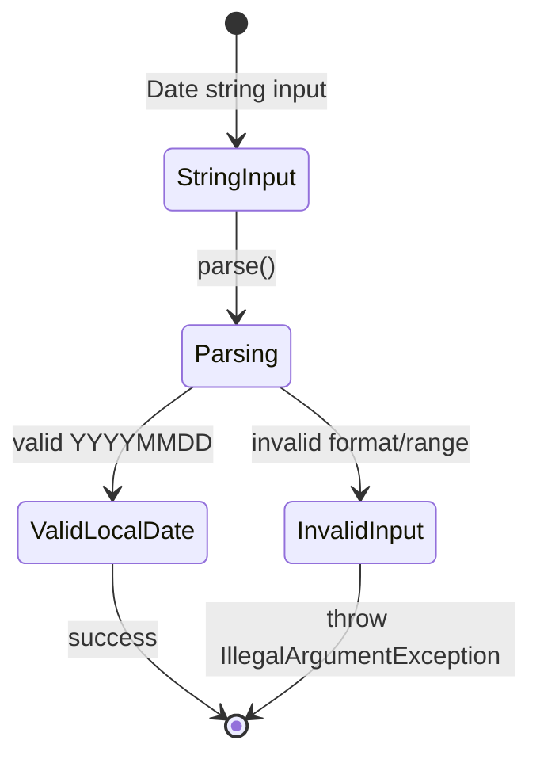
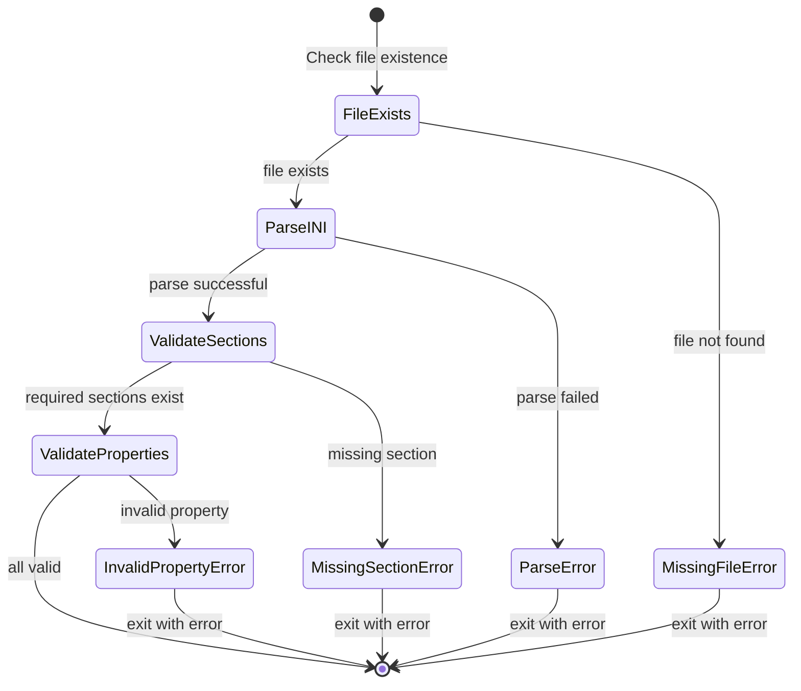

# Data Model: Refactor Date APIs and Add Default Config

**Date**: 2026-01-10  
**Branch**: 002-date-api-refactor  
**Status**: Phase 1 Design

## Overview

This feature refactors date handling in three core classes and adds a default INI configuration file. The data model changes involve:

1. **ETLContext**: Changes `currentDate` field type from `String` to `LocalDate`
2. **WorkflowResult**: Changes `startDate` and `endDate` field types from `String` to `LocalDate`
3. **DateRangeGenerator**: Changes return type from `List<String>` to `List<LocalDate>`
4. **ConfigurationFile**: New entity representing INI configuration

## Entities

### 1. DateField

**Description**: Strongly-typed date representation used throughout the system.

**Attributes**:
- `value` (LocalDate): The date value with year, month, day components
- `stringRepresentation` (String, derived): Date in "YYYYMMDD" format for serialization

**Constraints**:
- Must be a valid calendar date (no February 30, etc.)
- Year must be between 1900-2200 (reasonable business range)
- Month must be 1-12
- Day must be valid for the given month and year

**Relationships**:
- Used by `ETLContext.currentDate`
- Used by `WorkflowResult.startDate`, `WorkflowResult.endDate`
- Generated by `DateRangeGenerator.generate()`

### 2. ConfigurationFile

**Description**: INI configuration file providing runtime settings.

**Attributes**:
- `sections` (List<Section>): Configuration sections (e.g., [database], [logging])
- `properties` (Map<String, String>): Key-value pairs within sections
- `path` (String): File system location (e.g., `src/main/resources/config.ini`)

**Sections**:
- `[database]`: Connection parameters (url, username, password, driver)
- `[logging]`: Logging configuration (level, file, pattern)
- `[etl]`: ETL-specific settings (batch size, timeout, retries)
- `[subprocess]`: Subprocess execution parameters

**Validation Rules**:
- Required sections must exist (`[database]`, `[logging]`, `[etl]`)
- Required properties within sections must be non-empty
- Property values must match expected format (e.g., numeric where applicable)

## State Transitions

### Date Parsing State Machine

### Configuration Loading State Machine

## Impact Analysis

### Affected Classes

| Class | Field/Method | Original Type | New Type |
|-------|-------------|---------------|----------|
| `ETLContext` | `getCurrentDate()` | `String` | `LocalDate` |
| `WorkflowResult` | `startDate` | `String` | `LocalDate` |
| `WorkflowResult` | `endDate` | `String` | `LocalDate` |
| `DateRangeGenerator` | `generate()` | `List<String>` | `List<LocalDate>` |

### Dependent Code

- All callers of `ETLContext.getCurrentDate()` must be updated to handle `LocalDate`
- All callers of `WorkflowResult.getStartDate()`/`getEndDate()` must be updated
- All callers of `DateRangeGenerator.generate()` must be updated
- Serialization/deserialization code that expects String dates may need adaptation

### Migration Strategy

1. Update method signatures in target classes
2. Update internal implementations to use `LocalDate`
3. Update all callers to handle new types
4. Add conversion helpers where needed (e.g., `formatDate(LocalDate)`)
5. Ensure existing tests pass with new types

## Integration Points

### Date Formatting

- **Input**: CLI arguments in "YYYYMMDD" format
- **Internal**: `LocalDate` objects for type-safe operations
- **Output**: Logging and reporting may use formatted strings

### Configuration Access

- **Loader**: `ConfigurationLoader.java` reads INI files
- **Access**: Components access configuration via `ETConfiguration` POJO
- **Validation**: ConfigurationLoader validates required sections/properties

## Notes

- This refactoring improves type safety and reduces parsing overhead
- Existing tests serve as regression safety net
- No change to external interfaces (CLI arguments remain "YYYYMMDD" strings)